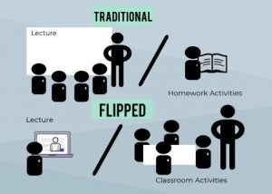

I am unfamiliar with Javascript so I was anxious going in. Since I do not know all the advantages and disadvantages, features and bugs of Javascript yet, I cannot really compare it with other programming languages, and determine whether it is a good or bad programming language. However, I had a hard time comprehending certain concepts in regards to ES6, for example:

using arrows functions:
```
const divide = (dividend, divisor) => dividend * divisor;
```

a variable can be function:

```
const num = function() {
  const numV = "value";
  return numV;
}
```
which can then can be rewritten as
```
const num = () => "value";
```

or passing an object as a function's parameters by destructuring assignments. That took me off guard as it was very different from C and Java. 
```
const shape = (shapeData) => {
  const { name, sides, length, width } = shapeData;
```

```
const shapeUpdate = ({ name, sides, length, width }) => { }
```


The idea of a flipped classroom seems effective at first glance. I do not find it very enjoyable and I know it does not work for me. Since the materials are all online, there is no way for me to know if the notes I am taking and studying will be of importance, which part I must focus on. Although I do see the appeal of allowing less time on concept explanation and more time for the Professor to apply the concepts to problems to solve during classtime. However, if the student is unable to conceptualize the material, they would end up being confused majority of classtime, trying to both understand the concept and be able to keep up with the application of the concept.
