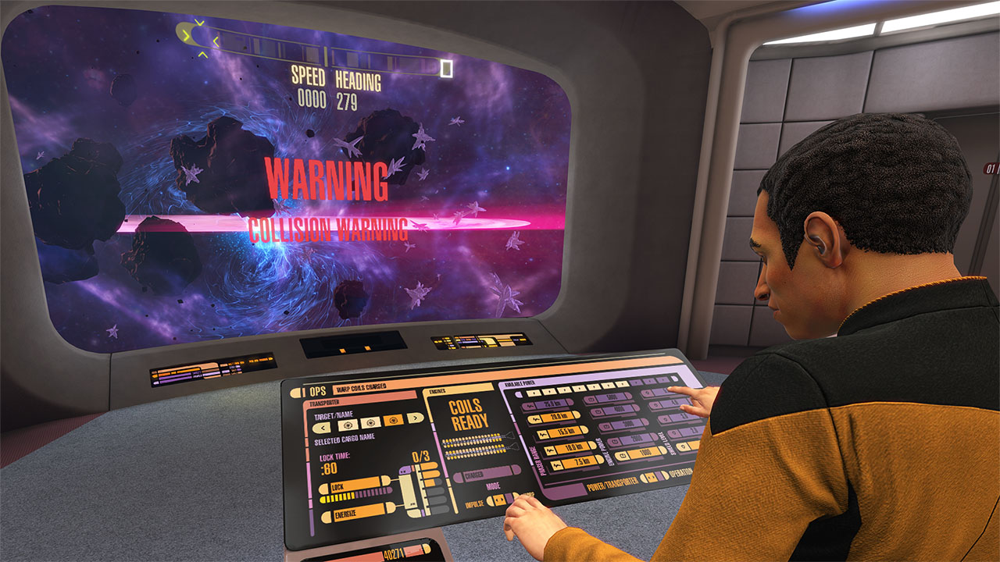

## Why am I here?
My interests in software engineering stemmed from the video game Star Trek: Bridge Crew. At first, I was not sure as to which part I was more intrigued by, the hardware or the software, whether it was the VR headset or the gameplay that was more compelling (I had sided with the hardware side). So I began my college career in Computer Engineering. However, after taking EE160, Programming for Engineers in C, that realized I enjoyed the software aspect also, specifically, I was curious in the development of the gameplay and user interfacings. So I had switched to Computer Science. To be quite honest, I had no idea what I wanted to major in when I began to think about my college career, I had started with Anthropology. So I am really thankful that I had stumbled upon the game. Even though I was going in completely blankslate into the major, and despite the fact that a lot of the Computer Science courses are quite difficult as the materials and concepts are perplexing, I find myself enjoying most of my classes, the materials, experiences and knowledge I acquired and learned.

## What did I gain?

Throughout my college career, I hope to develop skills which enable me to become an effective software engineer, which includes, but not limited to, being able to create algorithms that will decrease the amount of time I have to spend debugging my code, gaining more knowledge about different programming languages, the advantages and disadvantages of languages, being able to determine which language is the best solution to a problem needed to be solved. I believe these skills will greatly benefit me, as a software engineer.

As for experiences, I hope I will be able to meet with other software engineers, who I can not only learn from but also grow and develop with. Through teamwork and group projects, I hope I can be of benefit to others as they would to me. I also hope to be able to acquire more knowledge on my biggest interest, VR. As much as I do enjoy the courses I have taken so far, I hope to soon be able to take courses which are more related to VR.
