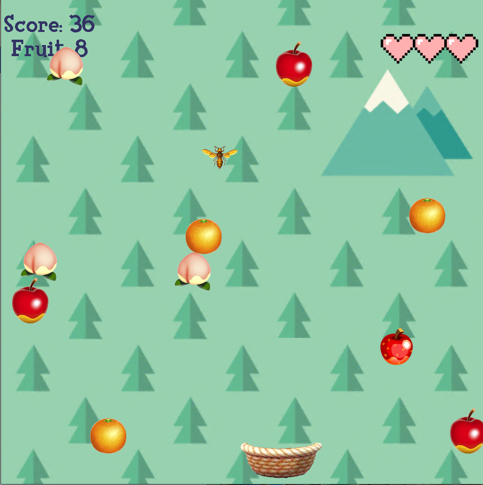

This project was implemented with Java. I found Java to be a bit easier of a language to learn. However, I do believe because my prior knowledge of C, I was able to catch on to Java much easier and faster. However, the differences between C and Java, with pointers and classes, was a small jump.

