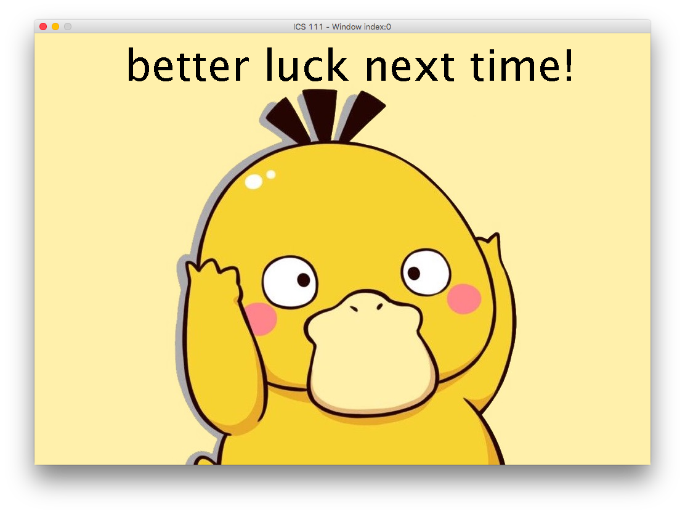

Tabblephis is a remake of the game Battleship I worked on with my group members for our final project in EE160. Tabblephis is implemented on Unix and in C. We were provided the displays and controls. The project required us to create an interface for the user to interact with, the scoring, and the implementations and mechanics of the boats.

This project was my first final project with coding. Working on this project was very difficult for my group members and I, as we were all beginners in both programming and the C language. We ran into difficulties and hurdles, some of which we were able to solve. This project allowed me to grow as a team member, to recognize how I should interact and what responsibilities I should expect of not only my team members but also myself.

