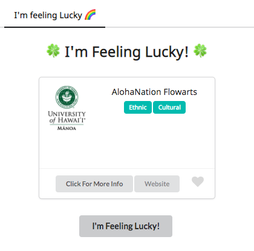

This is an application for students at University of Hawai'i to browse through clubs, developed by [Kevin Nguyen](https://kvndngyn.github.io/), [Tiffany Williams](https://tiffanywilliams.github.io/), [Julian Kim](https://julianki-cs.github.io/) and I. Together with my group we created the website using React and Semantic UI for the users to have an easier time navigating the long list as UH Manoa has almost 300 approved organizations. The application features are implemented with Meteor and MongoDB.

One of our features, I'm Feeling Lucky, I helped implement went through a few changes as at the beginning we had considered making it as a page on it's own, however through our own judgement and in addition to feedback, we found that the feature would be better placed in the user's profile. Through working in this project, I realized the importance of user's feedbacks even while developing an application.

For more information on the application: [CL-UH-B](https://cl-uh-b.github.io/)
