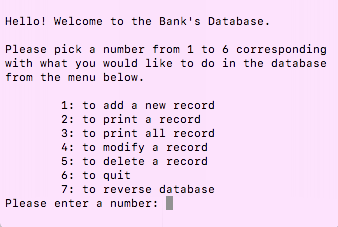

This is a program which allows the user to add, view, modify, and delete bank records, each option correlates with a number which the user will enter. At the beginning of the program, if there exists a bank record with records in it, the program will first add those records into the database. When the add option is selected the user is prompted to enter the record's account number, name, and the address. When the delete option is selected the user is prompted for the account number of the record to be deleted.

The C language was rigorous, as pointers is still a hard concept to completely understand and utilize. As I gained more knowledge in C, how to navigate Unix, and using the VIM text editor, I feel more confident in programming C.
